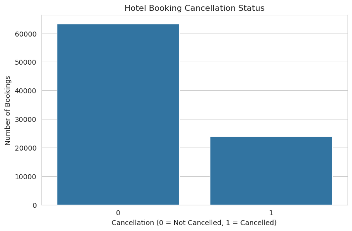
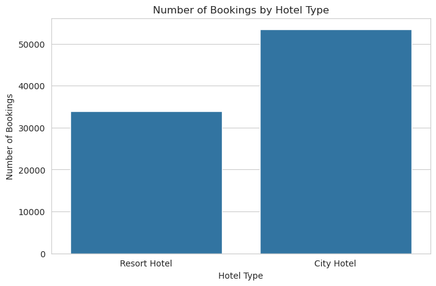
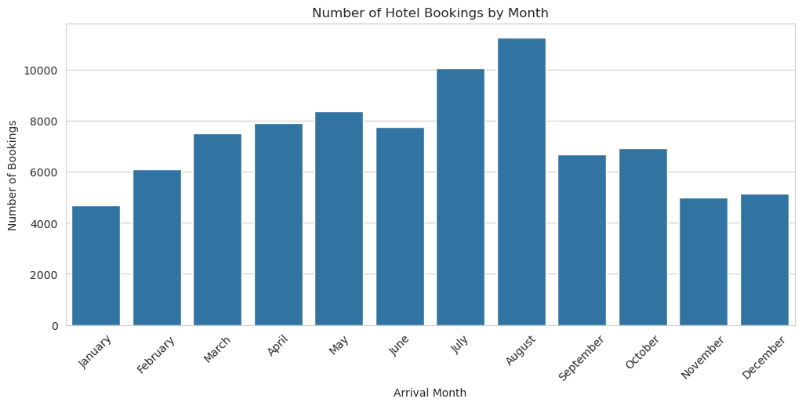
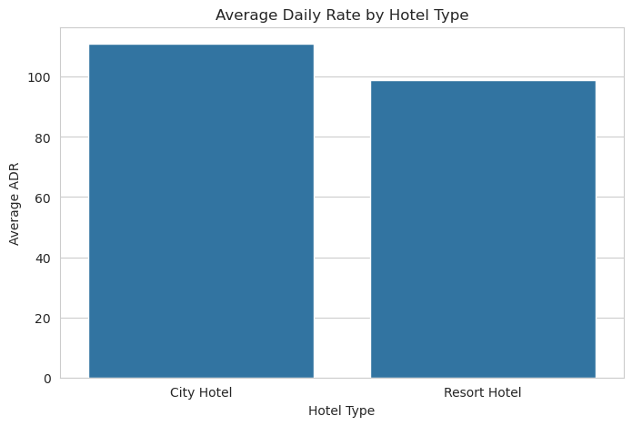
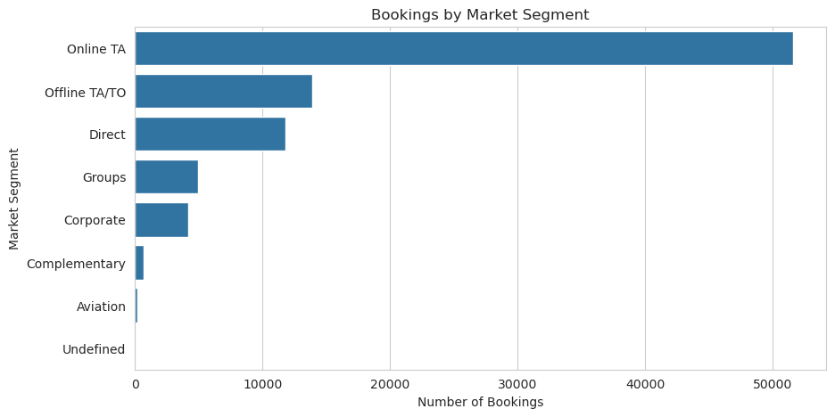
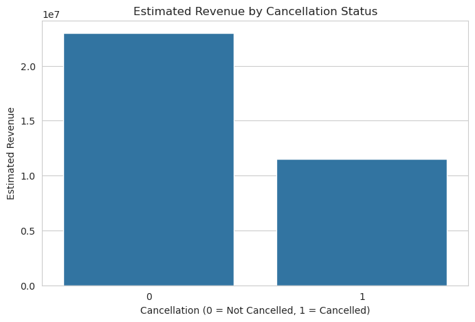

# Hotel Booking Demand Analysis

## Project Overview

This project analyzes hotel booking data to understand customer behavior, cancellation patterns, revenue impact, and booking trends.

The goal is to provide business insights that can help hotels improve revenue management, reduce cancellations, and optimize operations.

---

## Business Problem

Hotels need to understand booking behavior to reduce cancellations, improve revenue, and optimize hotel operations.

---

## Objectives

- Clean and prepare the dataset.
- Analyze booking trends.
- Investigate cancellation patterns.
- Study customer behavior.
- Generate business recommendations.

---

## Dataset

Hotel Booking Demand Dataset (Kaggle)

The dataset contains reservation information from City Hotels and Resort Hotels.

---

## Tools Used

- Python
- Pandas
- NumPy
- Matplotlib
- Seaborn
- Jupyter Notebook

---

## Analysis Performed

- Data cleaning
- Cancellation analysis
- Hotel performance analysis
- Customer behavior analysis
- Revenue impact analysis
- Booking trend analysis
- Correlation analysis

---

## Key Insights

- Cancellation behavior affects hotel revenue planning.
- Longer lead times are associated with higher cancellation risk.
- Online Travel Agencies are the main booking source.
- City Hotels receive more bookings than Resort Hotels.
- Booking demand changes by month.

---

## Visualizations

### Cancellation Analysis

---

### Hotel Type Performance

---

### Monthly Booking Trends

---

### Average Daily Rate (ADR)

---

### Market Segment Analysis

---

### Revenue Impact of Cancellations

## Business Recommendations

- Monitor high-risk reservations.
- Send reminders before arrival.
- Improve loyalty programs.
- Encourage direct bookings.
- Use seasonal pricing strategies.

---

## Author

Arista Kayirangwa Aimee
